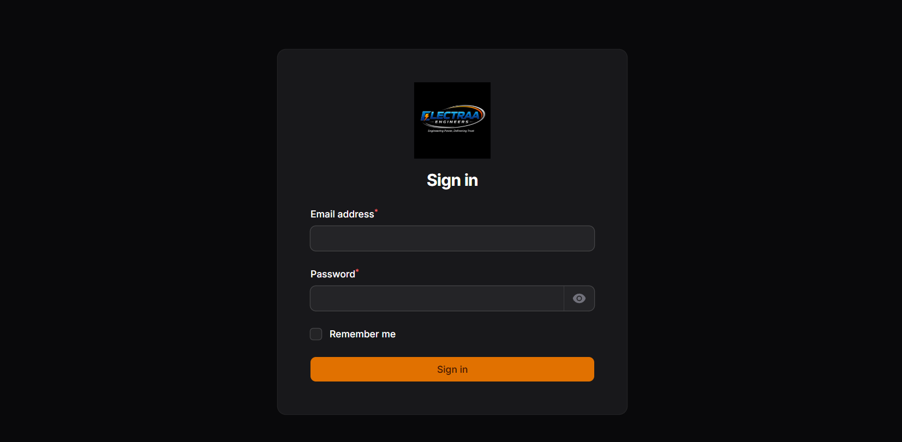
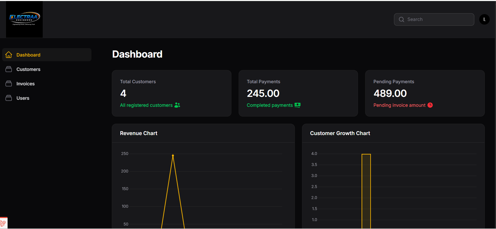
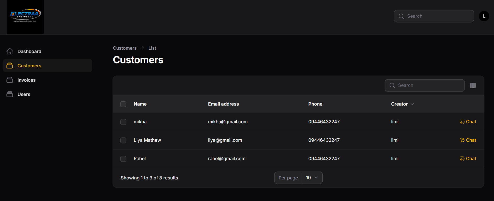
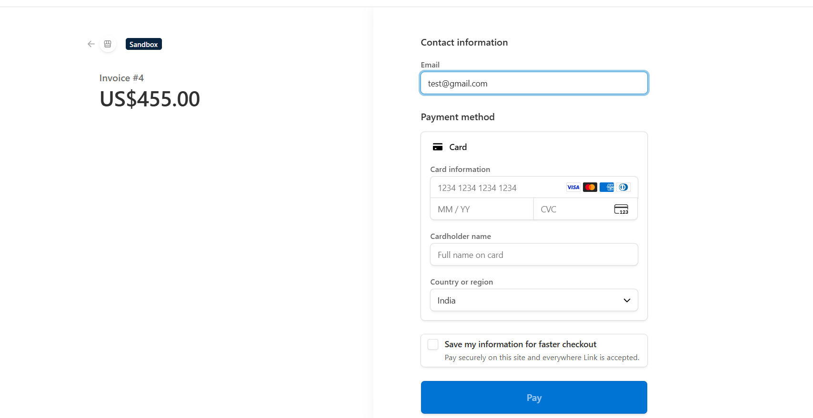
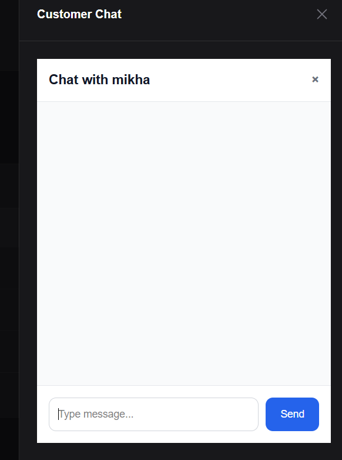
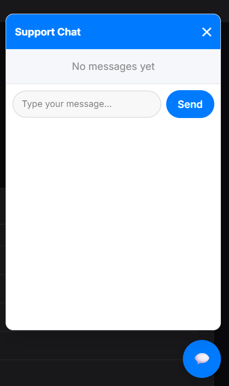
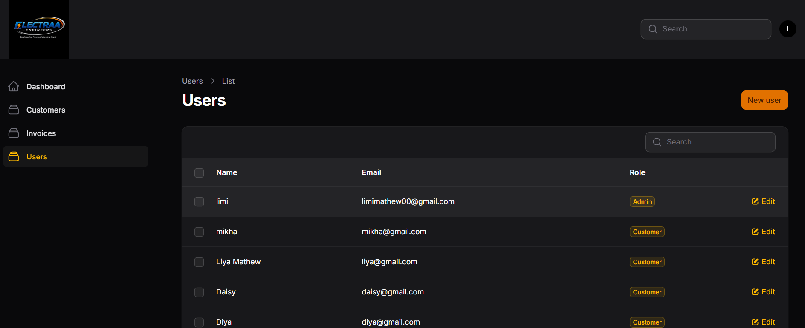
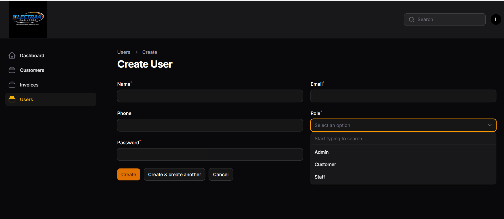
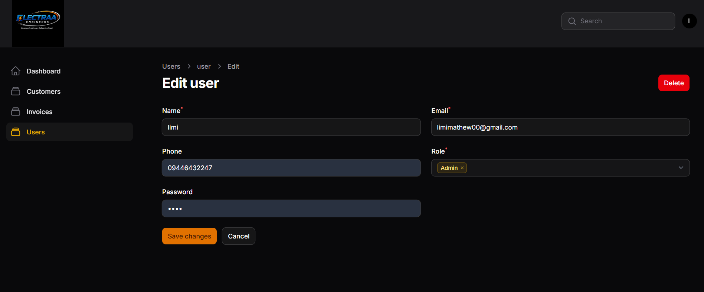
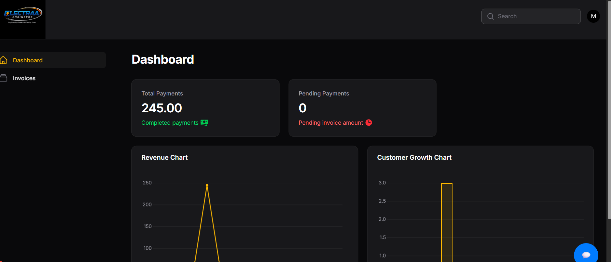

# Electraa CRM


Electraa CRM is a modern Laravel + Filament based Electrical Contract Management CRM built for learning advanced Laravel architecture, scalable backend systems, real-time communication, CI/CD workflows, and SaaS application concepts.

---

# Features

* Laravel 12 Application Architecture
* Filament Admin Dashboard
* Customer Management System
* Invoice Management Module
* Stripe Payment Integration
* Real-time Chat using Reverb + WebSockets
* Redis Queue & Cache Handling
* Livewire Support Chat
* Roles & Permissions using Spatie
* Dashboard Analytics & Revenue Charts
* Repository Pattern
* Service Layer Architecture
* Event-Driven Communication
* Queue Jobs & Background Processing
* Policy-Based Authorization
* Docker / Laravel Sail Environment
* ESLint + Prettier + Pint + PHPStan
* PHPUnit Testing
* GitHub Actions CI/CD Pipeline
* Render Deployment

---

# Tech Stack

## Backend

* Laravel 12
* PHP 8.2
* MySQL
* Redis
* Laravel Reverb
* Laravel Sail

## Frontend

* Livewire
* AlpineJS
* Blade

## Admin Panel

* FilamentPHP

## Quality Tools

* Laravel Pint
* PHPStan
* ESLint
* Prettier

## Deployment

* GitHub Actions
* Render

---

# Project Structure

```text
electraa-crm/
│
├── app/
│   ├── Actions/
│   │   └── Customer/
│   │
│   ├── Events/
│   ├── Filament/
│   │   └── Admin/
│   │
│   ├── Http/
│   ├── Jobs/
│   ├── Listeners/
│   ├── Livewire/
│   ├── Mail/
│   ├── Models/
│   ├── Policies/
│   ├── Providers/
│   ├── Repositories/
│   └── Services/
│
├── bootstrap/
├── config/
├── database/
│   ├── migrations/
│   └── seeders/
│
├── public/
├── resources/
├── routes/
├── storage/
├── tests/
│
├── .github/
│   └── workflows/
│       └── laravel.yml
│
├── docker/
├── composer.json
├── package.json
├── phpstan.neon
├── eslint.config.js
└── README.md
```

---

# Architecture Highlights

The project follows a modular Laravel architecture using:

* Repository Pattern
* Service Layer Pattern
* Action Classes
* Event-Driven Communication
* Queue Jobs
* Policy-Based Authorization
* Real-Time WebSocket Communication
* Filament Admin Architecture

---

# Screenshots

## Login Page



---

## Admin Dashboard



---

## Customer Management


---

## Invoice Management



---

## Real-time Chat



---

## User Managment






## Customer Dashboard




# Installation

```bash
git clone https://github.com/YOUR_USERNAME/electraa-crm.git

cd electraa-crm

composer install

cp .env.example .env

php artisan key:generate

php artisan migrate --seed

npm install

npm run build
```

---

# Run Locally

```bash
php artisan serve
```

Admin panel:

```bash
http://localhost/admin
```

---

# Quality Tools

## Frontend Quality Check

```bash
npm run quality
```

## PHP Static Analysis

```bash
vendor/bin/phpstan analyse app
```

## Laravel Pint Formatting

```bash
vendor/bin/pint
```

---

# Testing

```bash
php artisan test
```

---

# CI/CD Pipeline

GitHub Actions is used for:

* Automated Testing
* Pint Validation
* PHPStan Analysis
* ESLint Validation
* Deployment Workflow

Workflow file:

```text
.github/workflows/laravel.yml
```
---

# Author

Developed by Limi Mathew

## License

This project is open-sourced software licensed under the [MIT license](https://opensource.org/license/MIT).