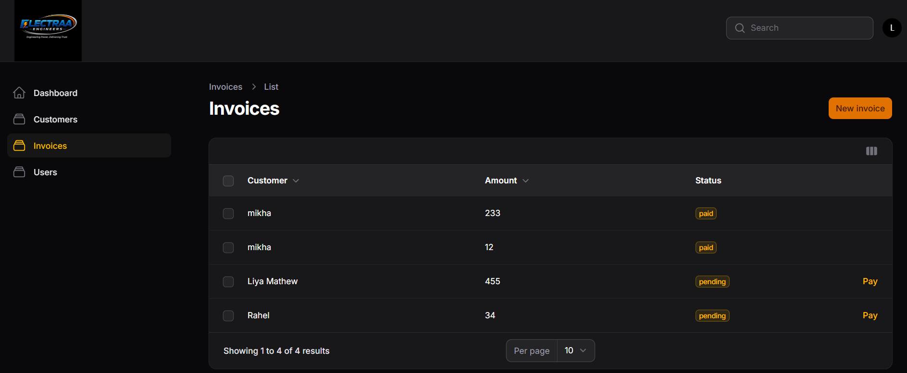

# Electraa CRM


Electraa CRM is a Laravel and Filament based Electrical Contract Management System that enables businesses to manage customers, invoices, payments, and real-time customer communication through a centralized administrative dashboard.

---

# Features

* Laravel 12 Application Architecture
* Filament Admin Dashboard
* Customer Management System
* Invoice Management Module
* Stripe Payment Integration
* Real-time Chat using Reverb + WebSockets
* Redis Queue & Cache Handling
* Livewire Support Chat
* Roles & Permissions using Spatie
* Dashboard Analytics & Revenue Charts
* Repository Pattern
* Service Layer Architecture
* Event-Driven Communication
* Queue Jobs & Background Processing
* Policy-Based Authorization
* Docker / Laravel Sail Environment
* ESLint + Prettier + Pint + PHPStan
* PHPUnit Testing
* GitHub Actions CI/CD Pipeline
* Render Deployment

---

# Tech Stack

## Backend

* Laravel 12
* PHP 8.2
* MySQL
* Redis
* Laravel Reverb
* Laravel Sail

## Frontend

* Livewire
* AlpineJS
* Blade

## Admin Panel

* FilamentPHP

## Quality Tools

* Laravel Pint
* PHPStan
* ESLint
* Prettier

## Deployment

* GitHub Actions
* Render

---

# Project Structure

```text
electraa-crm/
│
├── app/
│   ├── Actions/
│   │   └── Customer/
│   │
│   ├── Events/
│   ├── Filament/
│   │   └── Admin/
│   │
│   ├── Http/
│   ├── Jobs/
│   ├── Listeners/
│   ├── Livewire/
│   ├── Mail/
│   ├── Models/
│   ├── Policies/
│   ├── Providers/
│   ├── Repositories/
│   └── Services/
│
├── bootstrap/
├── config/
├── database/
│   ├── migrations/
│   └── seeders/
│
├── public/
├── resources/
├── routes/
├── storage/
├── tests/
│
├── .github/
│   └── workflows/
│       └── laravel.yml
│
├── docker/
├── composer.json
├── package.json
├── phpstan.neon
├── eslint.config.js
└── README.md
```
---

## Development Architecture

### Filament Admin Panel

* Admin panel built using FilamentPHP
* Custom Filament Resources
* Custom Widgets & Dashboard Analytics
* Separate Admin Panel Provider

### Authentication & Authorization

* Spatie Roles & Permissions
* Filament User Authentication

### Real-time Chat System

* Customer ↔ Admin chat support
* Redis broadcasting
* Laravel Reverb WebSockets
* Livewire real-time UI updates

### Payment System

* Stripe payment gateway integration
* Invoice payment handling
* Stripe keys configured using `.env`

### Performance & Debugging

* Laravel Debugbar for:

  * Query monitoring
  * N+1 detection
  * Eager loading analysis

* Laravel Telescope for:

  * Cache monitoring
  * Redis monitoring
  * Queue jobs
  * Events & batches
  * Application debugging

### Architecture Patterns

* Repository Pattern
* Service Layer
* Action Classes
* Event Driven Architecture

---

# Screenshots

## Login Page


---

## Admin Dashboard


---

## Customer Management


---

## Invoice Management



---

## Real-time Chat


---

## User Managment


## Customer Dashboard


# Installation

```bash

git clone https://github.com/YOUR_USERNAME/electraa-crm.git

cd electraa-crm

composer install

cp .env.example .env

php artisan key:generate

php artisan migrate --seed

npm install

npm run build
Run Project
php artisan serve

Admin Panel:

http://localhost/admin
Quality Tools
npm run quality

vendor/bin/phpstan analyse app

php artisan test

```
---

# Author

Developed by Limi Mathew

## License

This project is open-sourced software licensed under the [MIT license](https://opensource.org/license/MIT).